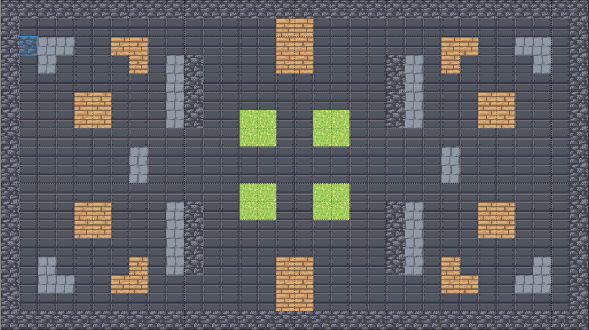
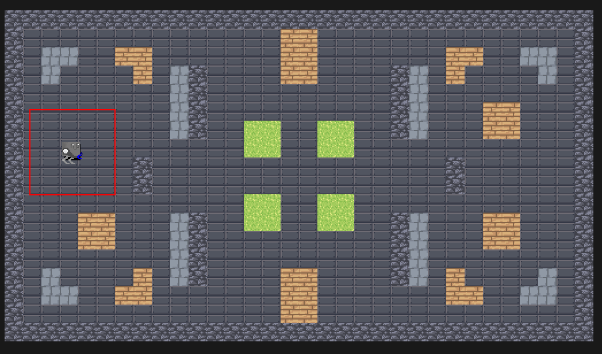
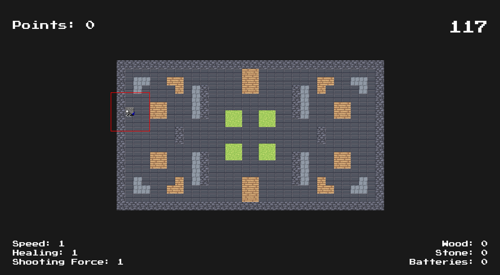
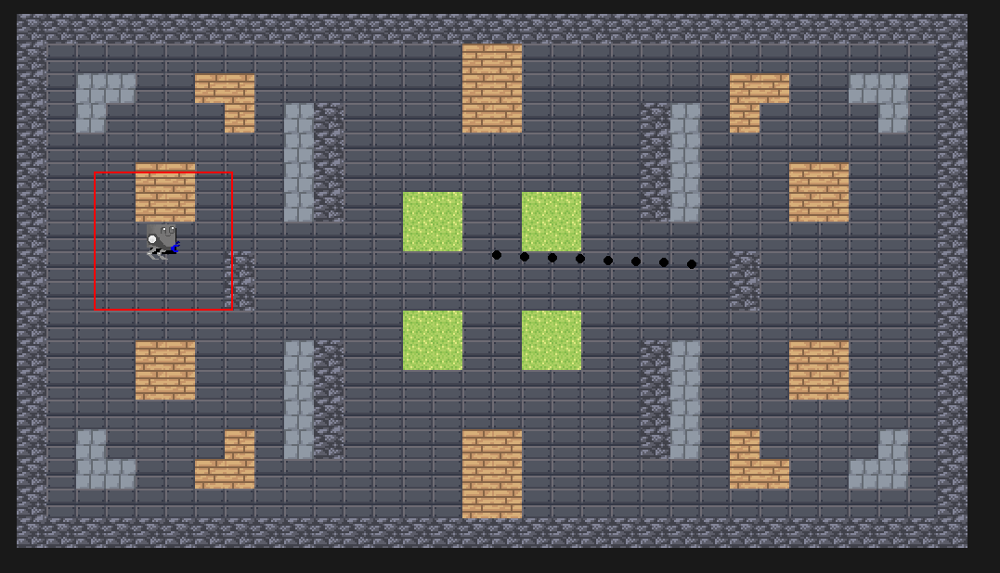

# RoboGame

# Jonathan

- added a new Arena Design.

- added the function that you can mine tiles and collect stone/wood resources.

- adapted the Font on screen so that it adapts to the screen size

# Matthias

- fixed all collision issues
- tried to add multiplayer

# Amina

- changed the font and adapted it for the new map.

- did some cleanups in the code and added documentation

- added a shooting effect.

