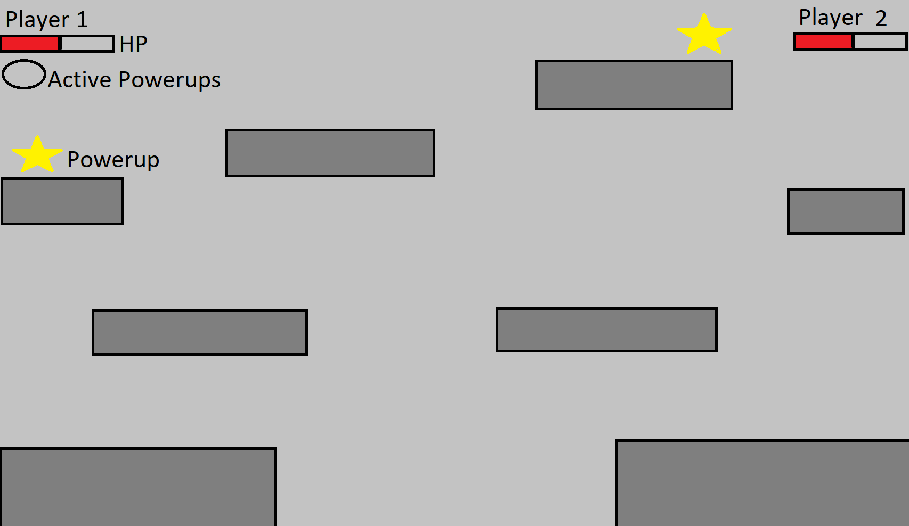
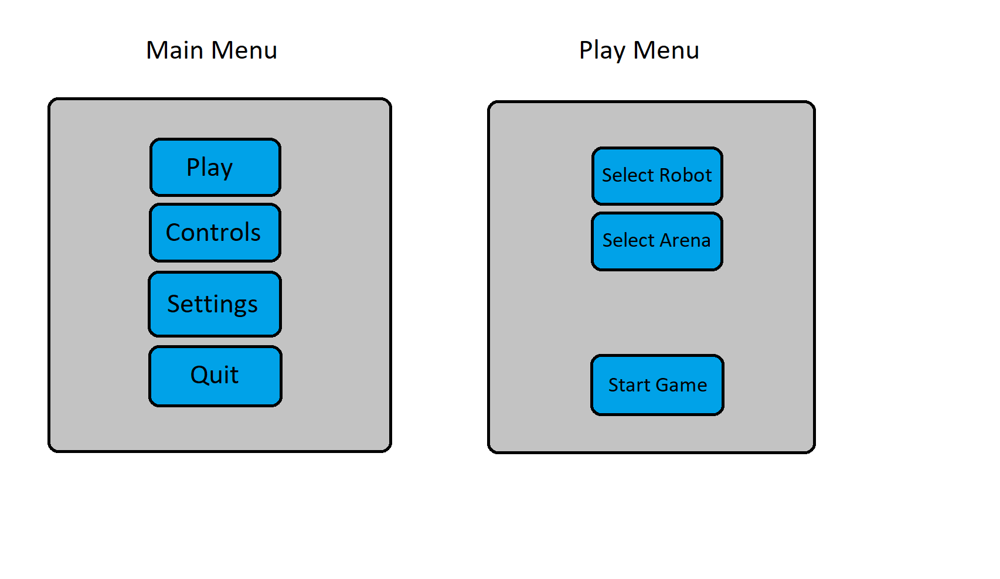
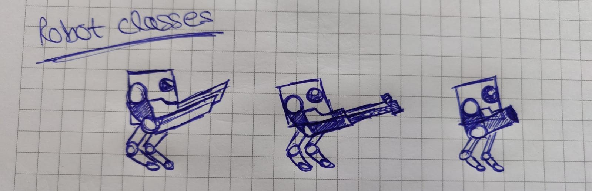
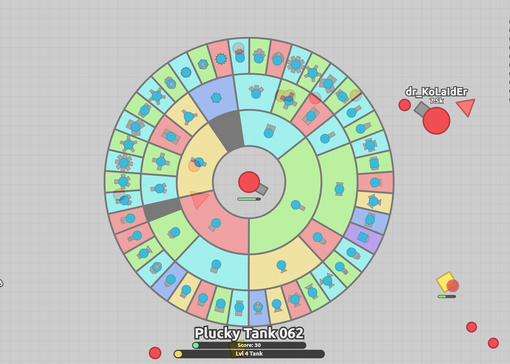
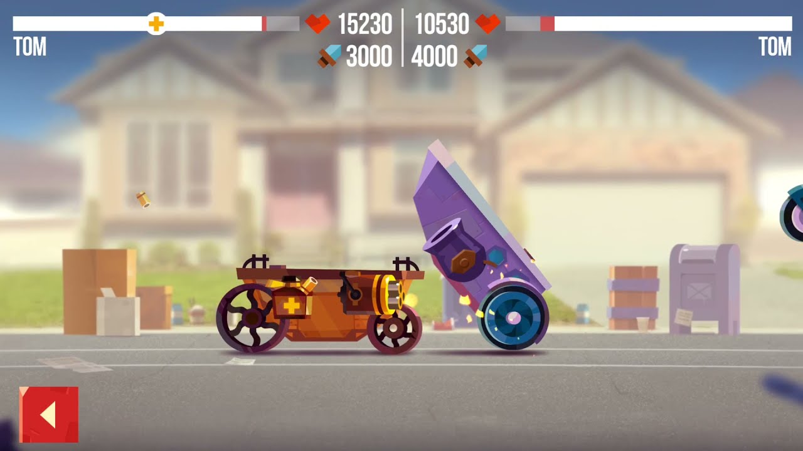
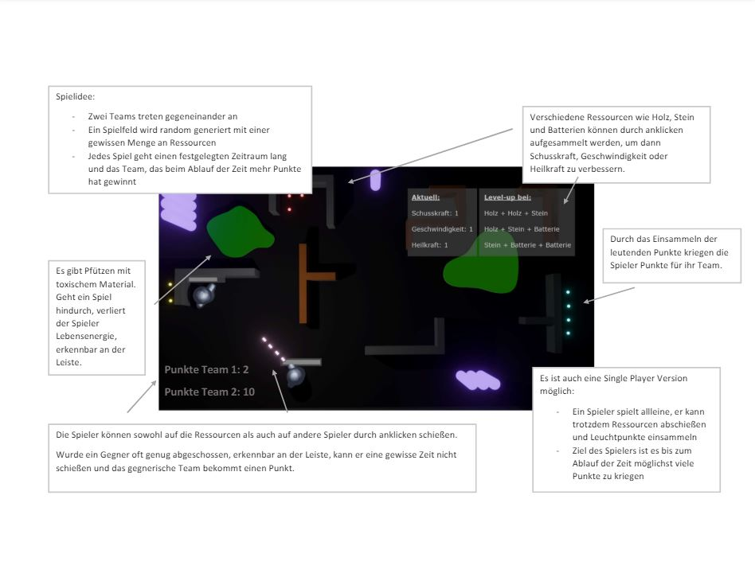
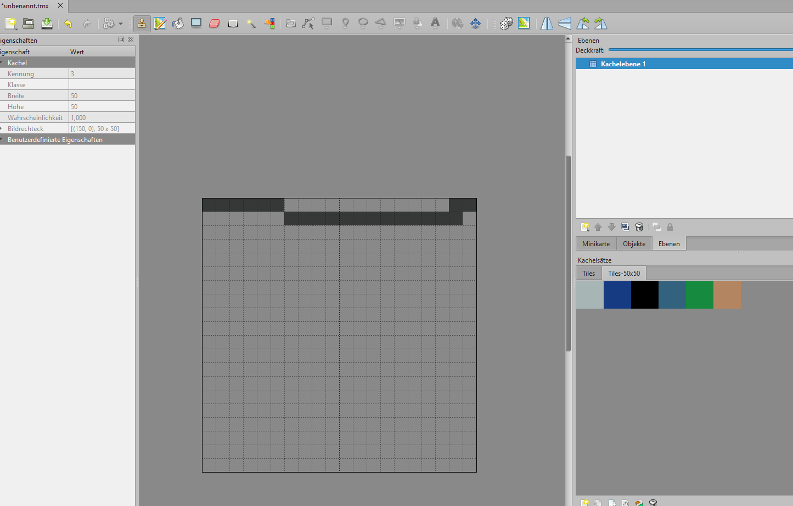
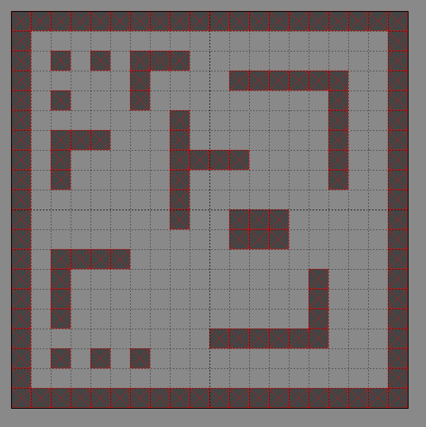
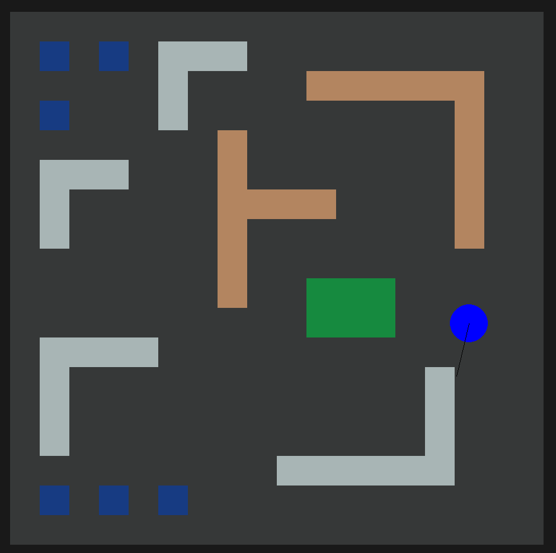

# RoboGame

# Sketches
## Jonathan

 

## Matthias

## Amina

# Arena

## Arena with Player
Currently we have a labyrinth with different tiles, that Jonathan and Matze created together, over which a player (blue circle) can move. Starting in the middle of the blue circle there is also a black line that ends at the position of the mouse. This can later help if we want to "shoot" in the direction of the mouse.
The movement of the player was also implemented by Jonathan and Matze, while the rest was made by Amina.
 
