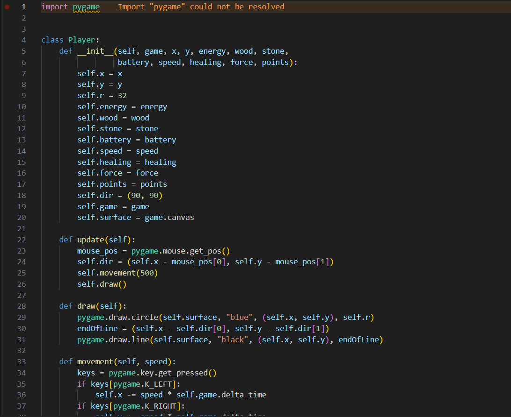
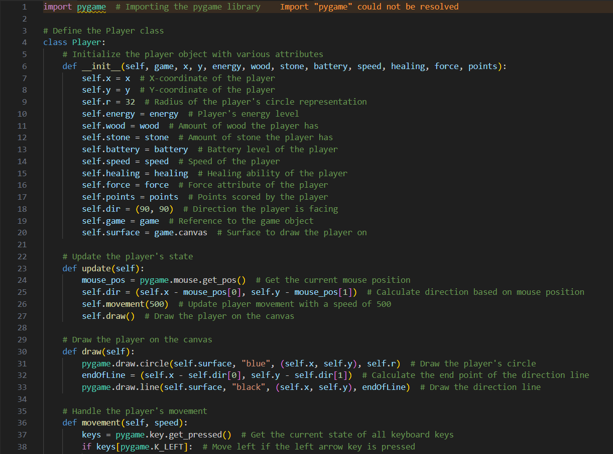

# RoboGame

# Coding
- We can store and load Tilemaps using "Tiled" which created .csv files (part of our Sprint_2 github.io page)

# Design

Jonathan added the function that the Game Window automatically adjusts to the screen size. 
The Game Window is now placed in the middle of the screen.

Jonathan added a free Tileset with 16x16 Tiles and designed the Arena with a different size.
(Tileset from itch.io: https://wareya.itch.io/versatile-255-tile-pixel-art-pack)

 

Jonathan added a Robot Design drawn using Gimp.

 

Matthias added a start screen and a menu screen and got started at trying to figure out collisions.

Amina added a timer as well as the player's points, properties and collections.

# AI Tools
Amina did 3a)
Jonathan did 3b)
Jonathan and Amina did 3c)

# AI Documentation

# AI Tests
Chatgpt created integration tests in a separate python file which should test if each class in the pygame code is
correctly initialized.
When running the test file there should be a result printed in the command line which shows the success or failure
of the test.
This is supposed to happen:

When running the test, there was no message, so the AI test didn't really work.

# AI Flake8 Correction
Chatgpt was able to fix a file with 19 Flake8 Errors. 

