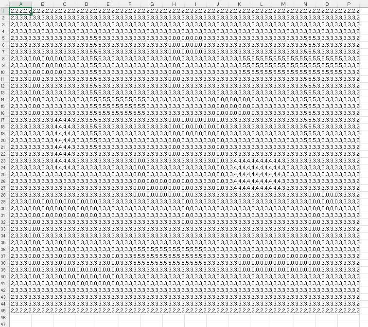
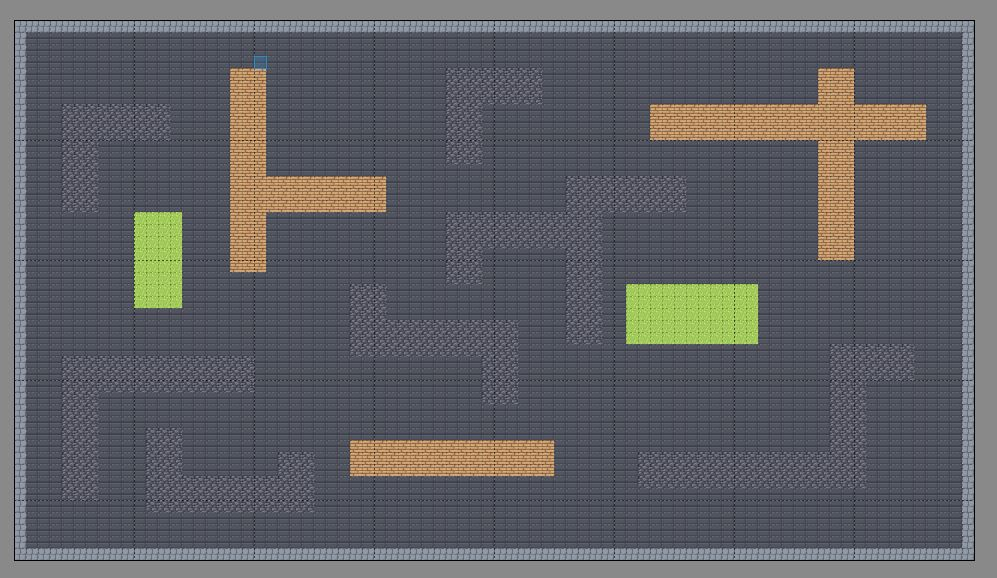
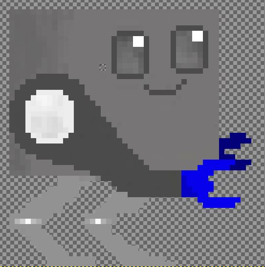
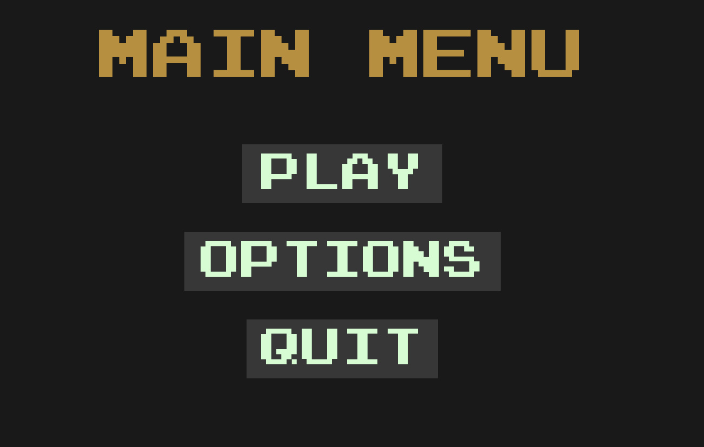
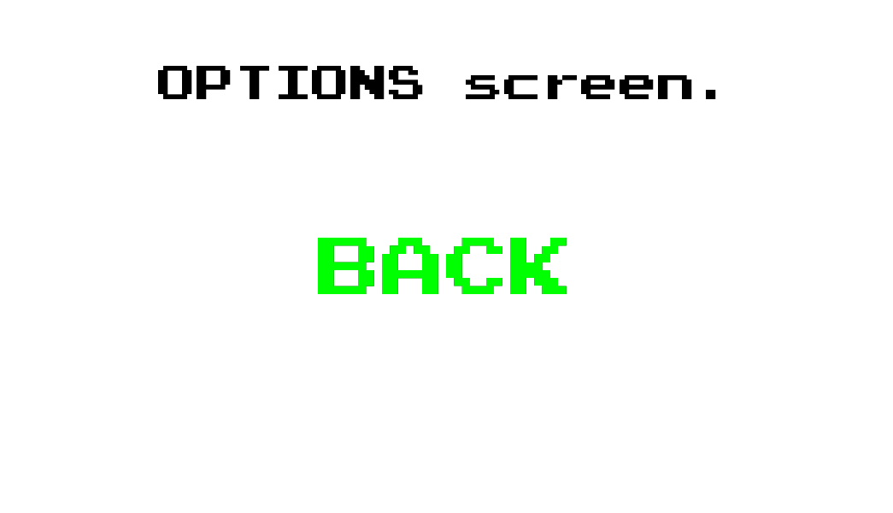
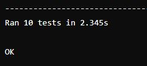
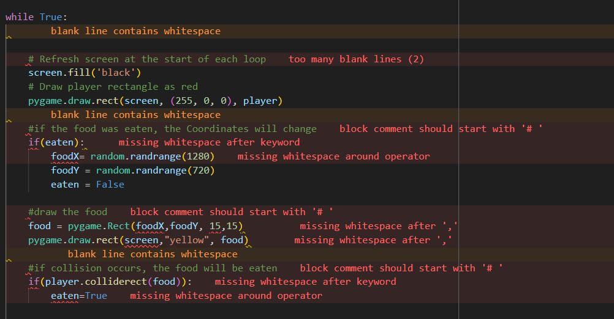
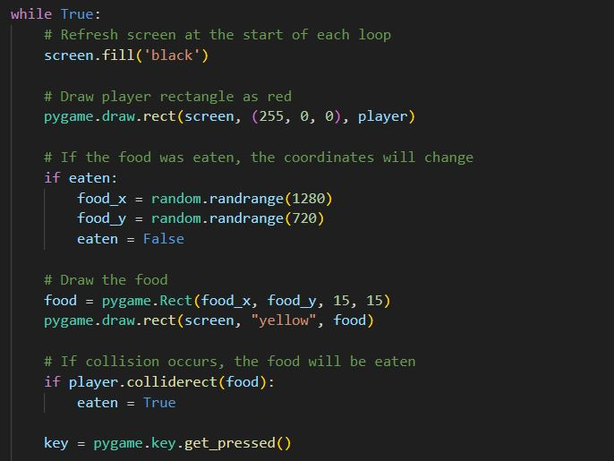
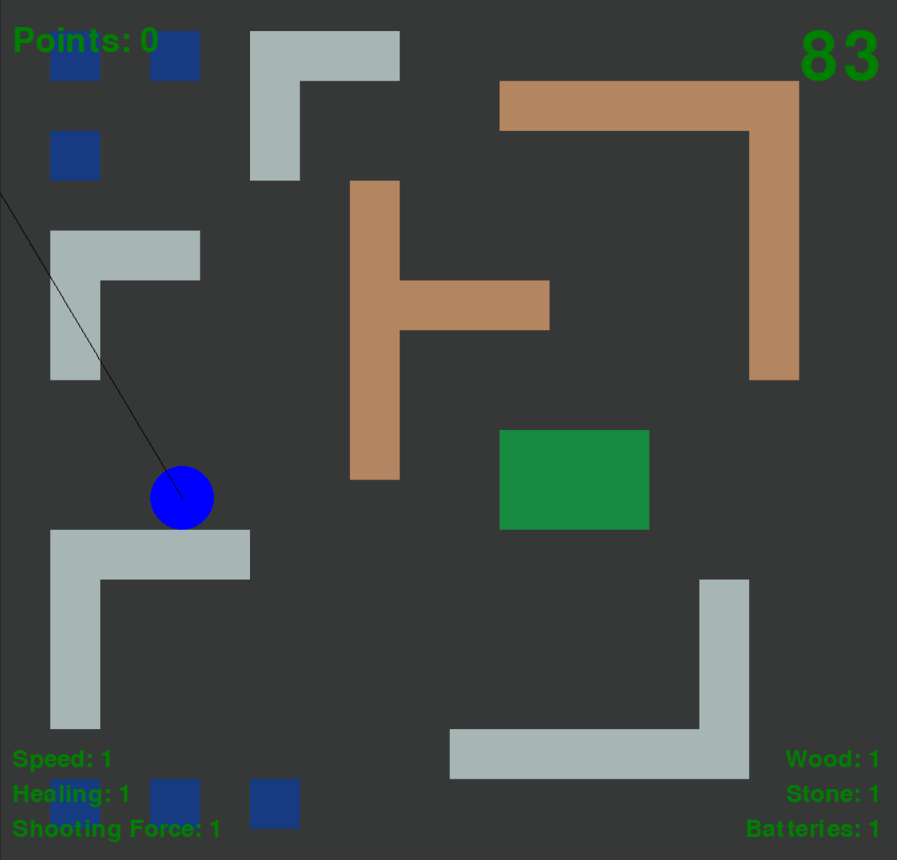

# RoboGame

# Sketches
## Jonathan

# Design

Jonathan added the function that the Game Window automatically adjusts to the screen size. 
The Game Window is now placed in the middle of the screen.

Jonathan added a free Tileset with 16x16 Tiles and designed the Arena with a different size.
(Tileset from itch.io: https://wareya.itch.io/versatile-255-tile-pixel-art-pack)
 

Jonathan added a Robot Design drawn using Gimp.
 

## Matthias

## Amina

# Arena

- created Arena with Level Editor "Tiled". Created the map by inserting Tiles into the Grid. 
You then get a csv file which has numbers for each Tile and makes building the Arena easier. 

## Arena with Player
Currently we have a labyrinth with different tiles, that Jonathan and Matze created together, over which a player (blue circle) can move. Starting in the middle of the blue circle there is also a black line that ends at the position of the mouse. This can later help if we want to "shoot" in the direction of the mouse.
The movement of the player was also implemented by Jonathan and Matze, while the rest was made by Amina.
