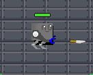
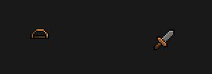
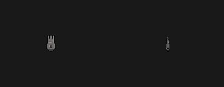
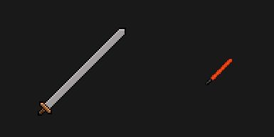
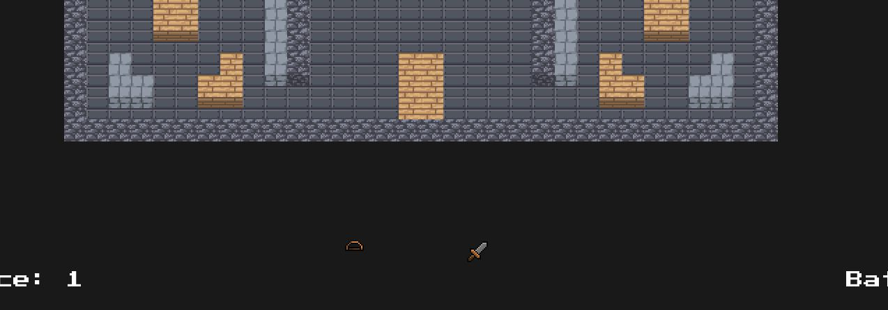
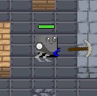
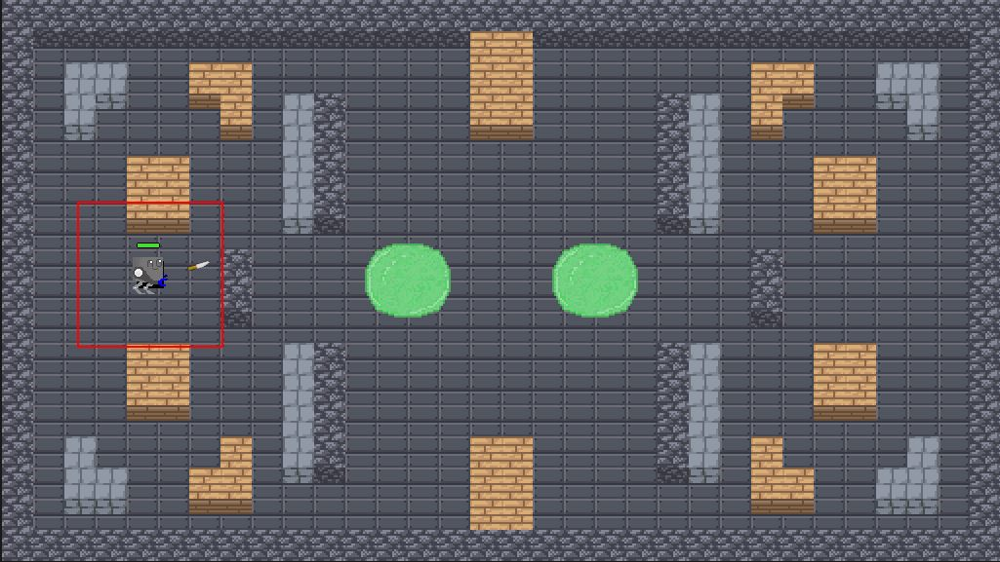
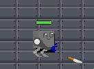

# RoboGame

## Amina
- added Weapons

- added the function that you can upgrade a weapon by selecting one of two upgrade weapons

## Matthias
- Update the map to 2.5d Version
- Synchronize the map
- Fix Position Issues

## Jonathan

- added Pickaxe to the game, player can now mine by holding right mouse button

- added new design for toxic puddle

- added healthbar, that displays the current health of the player

